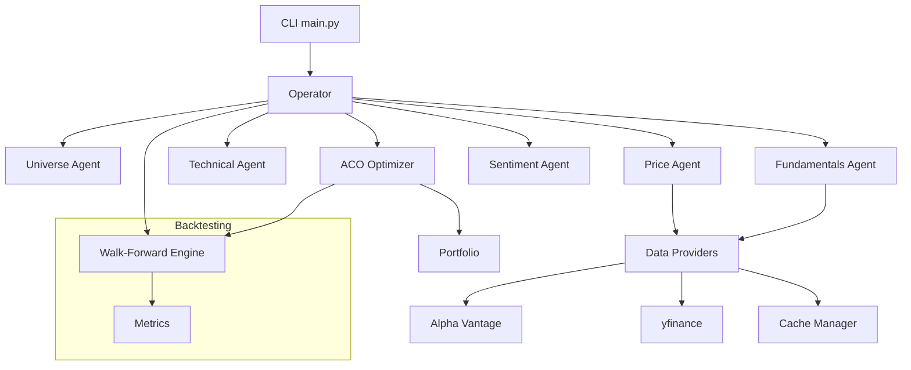
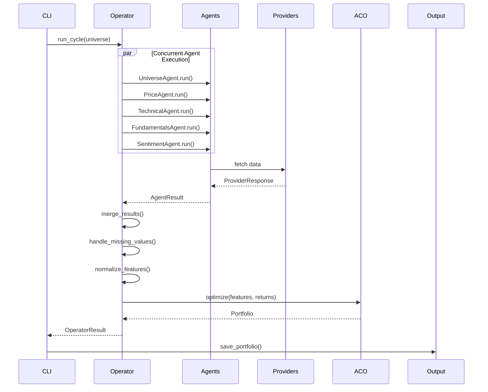

# Architecture

## System Overview

The ACO Portfolio Optimizer is a modular Python system for constructing optimized portfolios using Ant Colony Optimization. It follows an agent-based architecture where specialized agents gather data concurrently, an operator merges their outputs, and an ACO engine produces optimized allocations.

## High-Level Architecture



## Core Components

### 1. RunContext

Shared execution context passed to all agents:

```python
@dataclass
class RunContext:
    config: Config           # Application configuration
    logger: Logger           # Logging instance
    mode: str               # live | cached | test | backtest
    session: ClientSession  # aiohttp session (LIVE mode)
    rate_limiter: AsyncLimiter
    cache_manager: CacheManager
    start_date: date
    end_date: date
    random_seed: int | None
```

### 2. Agent Framework

All agents implement a common interface:

```python
class BaseAgent(ABC):
    @property
    def name(self) -> str: ...
    
    async def run(self, universe: list[str], ctx: RunContext) -> AgentResult: ...

@dataclass
class AgentResult:
    name: str
    data: pd.DataFrame  # Indexed by ticker
    metadata: dict      # timestamp, coverage, latency_ms, errors
```

### 3. Data Providers

Pluggable data sources with caching:

```python
class DataProvider(ABC):
    async def get_price_history(ticker, start, end, ctx) -> ProviderResponse
    async def get_fundamentals(ticker, ctx) -> ProviderResponse
```

**Implemented Providers:**
- `AlphaVantageProvider`: Primary API provider
- `YFinanceProvider`: Fallback using yfinance library

### 4. Operator

Orchestrates agent execution:

1. Launch all agents concurrently via `asyncio.gather(return_exceptions=True)`
2. Enforce per-agent timeouts with `asyncio.wait_for`
3. Collect results and log timing/coverage
4. Merge outputs into unified DataFrame
5. Handle missing values per config
6. Apply normalization

### 5. ACO Optimizer

Portfolio construction using Ant Colony Optimization:

**Weight Representation:**
- Weights discretized into 5% units (configurable)
- Total budget = 20 units (100% / 5%)
- Max per ticker = 2 units (10% / 5%)

**Probability Selection:**
```
P(ticker i, level j) ∝ τ[i,j]^α × η[i]^β
```
Where:
- τ = pheromone (learned attractiveness)
- η = heuristic (feature-derived desirability)
- α, β = importance weights

**Fitness Function:**
```
fitness = sharpe_ratio - constraint_penalty
sharpe = (annualized_return - rf) / annualized_volatility
```

**Constraints:**
- Sum of weights = 1 (or penalty)
- Max weight per ticker (default 10%)
- Min/max holdings count
- Optional sector caps

### 6. Walk-Forward Backtester

Rolling out-of-sample evaluation:

```
For each rebalance date:
    1. Define train window (lookback N days)
    2. Run operator → features
    3. Run ACO → weights
    4. Simulate test window
    5. Record return and turnover
    6. Roll forward
```

**Metrics Computed:**
- Cumulative return
- Annualized return/volatility
- Sharpe ratio
- Max drawdown
- Turnover

## Data Flow



## Data Contracts

### Agent Output Schema

| Agent | Columns | Index |
|-------|---------|-------|
| Universe | name, sector | ticker |
| Price | open, high, low, close, volume | (ticker, date) |
| Technical | returns_1m, volatility_21d, momentum_200d, ... | ticker |
| Fundamentals | market_cap, pe_ratio, eps, sector | ticker |
| Sentiment | sentiment_score, analyst_rating | ticker |

### Merged Feature Table

Single DataFrame indexed by ticker with columns:
- Technical indicators (normalized)
- Fundamental metrics (prefixed `fund_`)
- Sentiment scores (prefixed `sent_`)

## Error Handling

1. **Agent Failures**: Operator catches exceptions, logs errors, continues with available data
2. **API Errors**: Retries with exponential backoff, falls back to cache
3. **Missing Data**: Configurable strategy (drop, fill_median, fill_zero)
4. **Constraint Violations**: Soft penalties in fitness function

## Testability

1. **No Network in Tests**: Socket blocked in conftest.py
2. **Mock Providers**: Synthetic data fixtures
3. **Determinism**: Fixed random seeds
4. **Isolation**: Each agent testable independently

## Configuration

YAML configuration with sections:
- `providers`: API endpoints, keys, rate limits
- `agents`: Enable/disable, timeouts
- `aco`: Ants, iterations, evaporation
- `constraints`: Weight limits
- `backtest`: Window sizes
- `logging`: Levels, output
